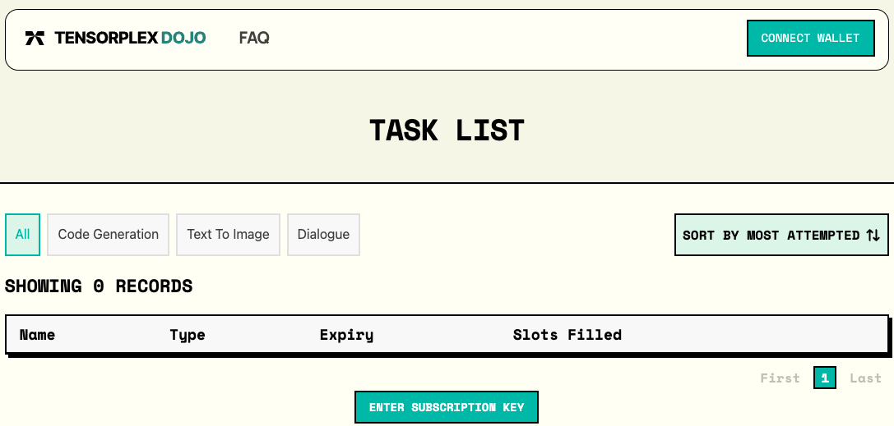
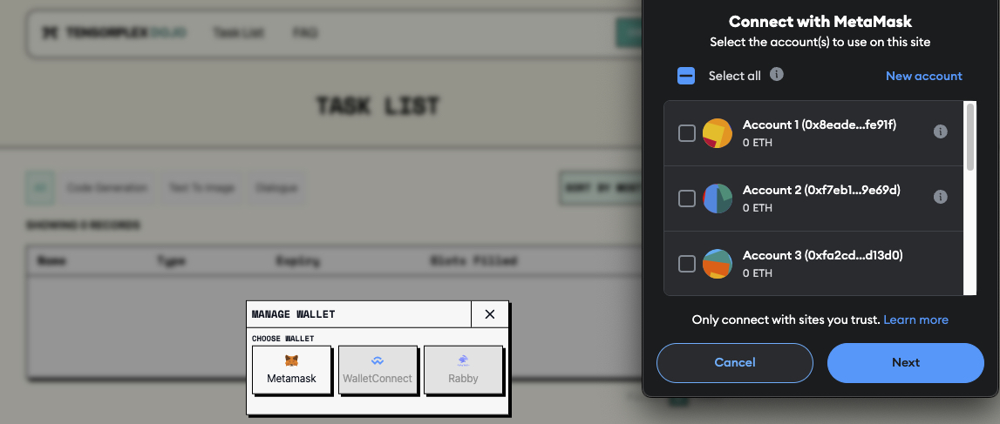
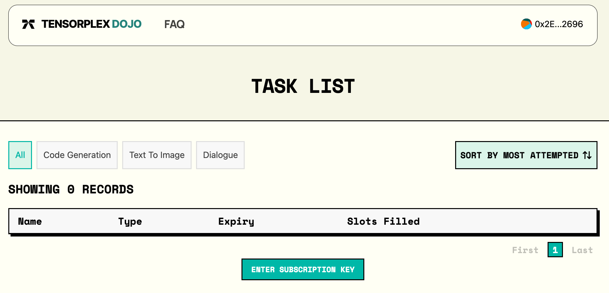
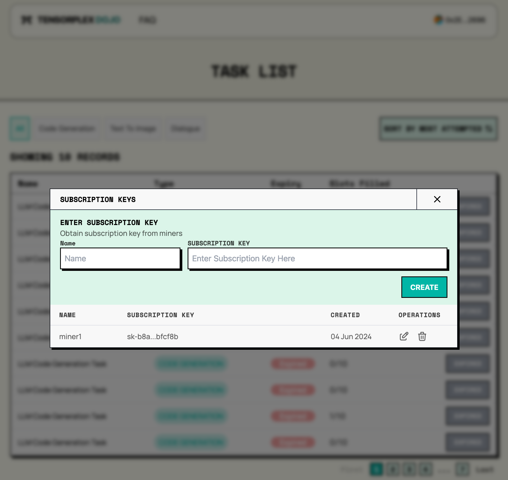

<div align="center">
  
  <h1 style="border-bottom: 0">Dojo Subnet</h1>
</div>

<div align="center">
  <a href="https://discord.gg/p8tg26HFQQ">
    
  </a>
  <a href="https://opensource.org/license/MIT">
    
  </a>
</div>

<br>

<div align="center">
  <a href="https://www.tensorplex.ai/">Website</a>
  ·
  <a href="https://docs.tensorplex.ai/tensorplex-docs/tensorplex-dojo-testnet">Docs</a>
  ·
  <a href="https://docs.tensorplex.ai/tensorplex-docs/tensorplex-dojo-testnet/whitepaper">Whitepaper</a>
  ·
  <a href="https://huggingface.co/tensorplex-labs">HuggingFace</a>
  ·
  <a href="#getting-started">Getting Started</a>
  ·
  <a href="https://twitter.com/TensorplexLabs">Twitter</a>
</div>

---

<details>
<summary>Table of Contents</summary>

- [Introduction](#introduction)
  - [Benefits to participants contributing through Dojo](#benefits-to-participants-contributing-through-dojo)
- [Prerequisites](#prerequisites)
  - [Validator](#validator)
  - [Miner](#miner)
- [System Requirements](#system-requirements)
  - [Miner](#miner-1)
  - [Validator](#validator-1)
- [Getting Started](#getting-started)
  - [Mining](#mining)
    - [Setup Subscription Key for Miners on UI to connect to Dojo Subnet for scoring](#setup-subscription-key-for-miners-on-ui-to-connect-to-dojo-subnet-for-scoring)
  - [Validating](#validating)
    - [Requirements for running a validator](#requirements-for-running-a-validator)
    - [Start Validating](#start-validating)
- [License](#license)

</details>

---

# Introduction

The development of open-source AI models is often hindered by the lack of high-quality human-generated datasets. Closed-source AI developers, aiming to reduce data collection costs, have created significant social and economic equity challenges, with workers being paid less than $2 per hour for mentally and emotionally taxing tasks. The benefits of these models have been concentrated among a select few, exacerbating inequalities among contributors.

Enter Tensorplex Dojo Subnet — an open platform designed to crowdsource high-quality human-generated datasets. Powered by Bittensor, the Dojo Subnet addresses these challenges by allowing anyone to earn TAO by labeling data or providing human-preference data. This approach democratizes the collection of human preference data, addressing existing equity issues and paving the way for more inclusive and ethical AI development.

Key Features

To ensure the quality and integrity of the data collected, Dojo introduces several novel features:

- Synthetic Task Generation: Unique tasks are generated by state-of-the-art Large Language Models (LLMs) to collect human feedback data, which can be used to improve open-source models.
- Synthetic Ground Truth Validation Mechanism: Validators can synthetically generate partial ground truths, allowing them to determine the quality of responses provided by individual participants.
- Obfuscation: Techniques to prevent sybil attacks and ensure contributions are genuinely human.

Use Cases

The Dojo Subnet offers multiple use cases:

- Synthetically Generated Tasks: These tasks can bootstrap the human participant pool and can be used for model training or fine-tuning from the outset.
- Cross-subnet Validation: Validators can use responses to rate the quality of outputs across other Bittensor subnets, thereby incentivizing miners to improve their performance.
- External Data Acquisition: Entities outside the Bittensor ecosystem can tap into the subnet to acquire high-quality human-generated data.

By creating an open platform for gathering human-generated datasets, Tensorplex Dojo Subnet aims to solve the challenges of quality control, human verification, and sybil attack prevention while promoting a more equitable distribution of benefits in AI development.

## Benefits to participants contributing through Dojo

- Open platform: Anyone capable can contribute, ensuring broad participation and diverse data collection.

- Flexible work environment: Participants enjoy the freedom to work on tasks at their convenience from any location.

- Quick payment: Rewards are streamed consistently to participants, as long as they complete sufficient tasks within a stipulated deadline and have them accepted by the subnet.

<br>

# Prerequisites

## Validator

- Python >=3.10
- PM2
- Docker
- Third party API Keys **(Validators Only)**
  - OpenRouter
  - wandb
  - Together **(Optional)**
  - OpenAI **(Optional)**

## Miner

- Python >=3.10
- PM2
- Docker

# System Requirements

## Miner

- 2 cores
- 4 GB RAM
- 32GB SSD

## Validator

- 4 cores
- 8 GB RAM
- 256 SSD

# Getting Started

To get started as a miner or validator, these are the common steps both a miner and validator have to go through.

> The following guide is tailored for distributions utilizing APT as the package manager. Adjust the installation steps as per the requirements of your system.
>
> We will utilize ~/opt directory as our preferred location in this guide.

Install PM2 (**If not already installed**)

```bash
cd dojo/scripts/setup/
./install_pm2.sh
```

Install Docker (**If not already installed**)

```bash
./install_docker.sh
```

Clone the project, set up and configure python virtual environment

```bash
# In this guide, we will utilize the ~/opt directory as our preferred location.
cd ~/opt

# Clone the project
git clone https://github.com/tensorplex-labs/dojo.git
cd dojo/
git submodule update --init

# Set up python virtual environment and pip packages
# Here we use venv for managing python versions

python3 -m venv env
source env/bin/activate
pip install -e .
# for developers, install the extras
pip install -e ".[dev]"
```

## Mining

Activate the python virtual environment

```bash
source env/bin/activate
```

Create your wallets and register them to our subnet

```bash
# create your wallets
btcli wallet new_coldkey

btcli wallet new_hotkey

# register your wallet to our subnet
# Testnet
btcli s register --wallet.name coldkey --wallet.hotkey hotkey --netuid 98 --subtensor.network test
```

Retrieve the API Key and Subscription Key with Dojo CLI

```bash
# Start the dojo cli tool
# Upon starting the CLI it will ask if you wanna use the default path for bittensor wallets, which is `~/.bittensor/wallets/`.
# If you want to use a different path, please enter 'n' and then specify the path when prompted.
dojo

# TIP: During the whole process, you could actually use tab-completion to display the options, so you don't have to remember them all. Please TAB your way guys! 🙇‍♂️
# It should be prompting you to enter you coldkey and hotkey
# After entering the coldkey and hotkey, you should be in the command line interface for dojo, please authenticate by running the following command.
# You should see a message saying "✅ Wallet coldkey name and hotkey name set successfully."
authenticate

# Afterwards, please generate an API Key with the following command.
# You should see a message saying:  "✅ All API keys: ['sk-<KEY>]". Displaying a list of your API Keys.
api_key generate

# Lastly, please generate a Subscription Key with the following command.
# You should see a message saying:  "✅ All Subscription keys: ['sk-<KEY>]". Displaying a list of your Subscription Keys.
subscription_key generate

# :rocket: You should now have all the required keys, and be able to start mining.

# Other commands available to the CLI:
# You can always run the following command to get your current keys.
api_key list
subscription_key list

# You can also delete your keys with the following commands.
api_key delete
subscription_key delete
```

Create .env file

```bash
# copy .env.miner.example
cp .env.miner.example .env

# ENV's that needs to be filled for miners:
DOJO_API_KEY="sk-<KEY>"
DOJO_API_BASE_URL="https://dojo-api-testnet.tensorplex.ai"
```

Start the miner by running the following commands:

```bash
# For Testnet
docker compose up -d miner-testnet
```

### Setup Subscription Key for Miners on UI to connect to Dojo Subnet for scoring

Note: URLs are different for devnet, testnet and mainnet.
Testnet: https://dojo-api-testnet.tensorplex.ai
Mainnet: **_REMOVED_**

1. Head to https://dojo-testnet.tensorplex.ai and login and sign with your Metamask wallet.

- You'll see an empty homepage with no Tasks, and a "Connect" button on the top right 
- Click on "Connect" and you'll see a popup with different wallets for you to connect to 
- Click "Next" and "Continue", then finally it will be requesting a signature from your wallet, please sign and it will be connected. 
- Once connected, the top navigation bar should display your wallet address. 

2. Once connected, please stay connected to your wallet and click on "Enter Subscription Key". 

- Give your subscription a name, and enter your subscription key generated earlier before running the miner. _*Refer to step 4 of "Getting Started" if you need to retrieve your key*_ 
- Click "Create" and your subscription will be saved. 
- Confirmed your subscription is created properly, and that you can view your tasks! 

## Validating

### Requirements for running a validator

- Openrouter API Key
- Deploy the synthetic QA API on the same server as the validator

Pull the synthetic qa api git submodule

```bash
# pull submodules
git submodule update --init
```

Setup the env variables, these are marked with "# CHANGE" in `dojo-synthetic-api/docker-compose.yml`

Run the server

```bash
cd dojo-synthetic-api
docker compose up -d
```

### Start Validating

Head back to dojo project and set up the .env file

```bash
cd dojo

# copy .env.validator.example
cp .env.validator.example .env

# edit the .env file with vim, vi or nano
# Please select one
DOJO_API_BASE_URL="https://dojo-api-testnet.tensorplex.ai"
SYNTHETIC_API_URL="http://127.0.0.1:5003"
TOKENIZERS_PARALLELISM=true
OPENROUTER_API_KEY="sk-or-v1-<KEY>"
WANDB_API_KEY="<wandb_key>"

# Optional or if you've chosen it
TOGETHER_API_KEY=
OPENAI_API_KEY=
```

Start the validator

```bash
# start the validator
# Testnet
docker compose up -d validator-testnet
```

To start with autoupdate for validators (**optional**)

```bash
# Testnet
pm2 start run.sh \
--interpreter bash \
--name dojo-autoupdater \
-- --wallet.name coldkey \
--wallet.hotkey hotkey \
--logging.debug \
--subtensor.network test \
--neuron.type validator \
--axon.port 9603
```

# License

This repository is licensed under the MIT License.

```text
# The MIT License (MIT)
# Copyright © 2023 Yuma Rao

# Permission is hereby granted, free of charge, to any person obtaining a copy of this software and associated
# documentation files (the "Software"), to deal in the Software without restriction, including without limitation
# the rights to use, copy, modify, merge, publish, distribute, sublicense, and/or sell copies of the Software,
# and to permit persons to whom the Software is furnished to do so, subject to the following conditions:

# The above copyright notice and this permission notice shall be included in all copies or substantial portions of
# the Software.

# THE SOFTWARE IS PROVIDED "AS IS", WITHOUT WARRANTY OF ANY KIND, EXPRESS OR IMPLIED, INCLUDING BUT NOT LIMITED TO
# THE WARRANTIES OF MERCHANTABILITY, FITNESS FOR A PARTICULAR PURPOSE AND NONINFRINGEMENT. IN NO EVENT SHALL
# THE AUTHORS OR COPYRIGHT HOLDERS BE LIABLE FOR ANY CLAIM, DAMAGES OR OTHER LIABILITY, WHETHER IN AN ACTION
# OF CONTRACT, TORT OR OTHERWISE, ARISING FROM, OUT OF OR IN CONNECTION WITH THE SOFTWARE OR THE USE OR OTHER
# DEALINGS IN THE SOFTWARE.
```
